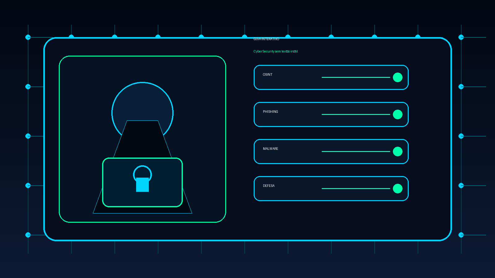

<h1 align="center">🛡️ Trilha CyberSec — Do Zero ao Hacker Ético</h1>

<p align="center">
  Guia interativo de <b>cibersegurança</b> em português — uma trilha de estudo visual que vai do
  mindset aos ataques avançados, com foco em <b>ética, defesa e prática</b>.
</p>

<p align="center">
  <a href="https://victorxxll2023-glitch.github.io/cybersecurity-interactive-guide/"><b>🔗 Ver demo ao vivo</b></a>
</p>

<p align="center">
  
</p>

> ⚠️ **Aviso:** projeto **100% educacional e defensivo**. Todo conteúdo ofensivo é apresentado com aviso de
> uso **somente em laboratório, em sistema próprio ou em pentest autorizado** — conforme a Lei 12.737/2012
> (Carolina Dieckmann) e a LGPD. Nada de dados de terceiros.

---

## ✨ O que tem

- **7 trilhas · 130+ conceitos** com o botão **“📖 Aprender a fundo”**: explicação completa, diagramas (SVG),
  exemplos reais, casos famosos e **como se defender**.
  - 🌐 Redes (base) · 🧠 Fundamentos · 🔍 Recon/OSINT · 🛠️ Ferramentas · ⚔️ Ataques · 🛡️ Defesa/Blue Team · 🔐 Avançado
- **🧰 Gerador de comandos** parametrizável (digita o alvo → comando pronto pra copiar):
  - **Google Dorks** (clique e abre no Google), **Comandos** (Nmap, Hydra, sqlmap, gobuster…) e
    **“Como descobrir”** (qual comando usar quando falta IP, portas, subdomínios…).
- **📋 Dossiê do alvo** — anota IP/DNS/portas/achados (salvo no navegador, com copiar/baixar).
- **🎮 Quiz** (15 perguntas), **✓ progresso** por nível, **🗺️ roteiro de estudo com labs** (TryHackMe/HTB),
  **🗄️ bases** (NVD, VirusTotal, MITRE ATT&CK, wordlists…) e **player de vídeo embutido**.
- **Comandos clicáveis** que copiam com marcadores (`<IP_DO_ALVO>`, `<wordlist>`…) e dizem o que editar.
- **Busca**, **navegação por abas**, tema escuro “hacker discreto” e **hero em terminal**.

## 🧱 Stack

- **HTML + CSS + JavaScript puro** (vanilla) — **sem framework, sem build, sem backend**.
- `localStorage` para progresso e dossiê.
- Fontes: **Inter** + **JetBrains Mono**.
- Hospedado no **GitHub Pages**.

## 🗂️ Estrutura

```
index.html     → tudo (HTML + CSS no <style> + JS em IIFEs no final)
img/           → imagens reais (Wireshark, Zenmap, Metasploit, Kali, mapa WannaCry)
hero.png       → arte / og:image
CLAUDE.md      → memória/documentação do projeto
```

## ▶️ Rodar localmente

```bash
git clone https://github.com/victorxxll2023-glitch/cybersecurity-interactive-guide.git
cd cybersecurity-interactive-guide
# abra o index.html no navegador, ou:
python3 -m http.server 8000   # depois acesse http://localhost:8000
```

## 🔒 Ética & uso responsável

Este material ensina técnicas ofensivas **para fins de aprendizado e defesa**. Pratique **apenas**:
- em **laboratórios** (TryHackMe, Hack The Box, máquinas vulneráveis suas),
- em **sistemas próprios**, ou
- em **pentests com autorização por escrito**.

Acesso/ataque a sistemas de terceiros sem consentimento é crime (Lei 12.737/2012). Para checar exposição
pessoal, use apenas o **Have I Been Pwned** com o **seu próprio** e-mail.

## 📚 Créditos

- Conteúdo baseado nos materiais da **TI Academy — Prof. Robson Costa** (#professordeti).
- Imagens reais via **Wikimedia Commons** (licenças GPL / CC BY-SA) — créditos nas legendas.
- Vídeos incorporados de seus respectivos autores no YouTube.
- Projeto **pessoal de estudo**, desenvolvido com apoio de IA como par de programação.

## 📄 Licença

Código aberto para fins **educacionais**. O conteúdo didático é baseado em materiais de terceiros (ver Créditos);
não use comercialmente sem verificar as licenças das fontes.
